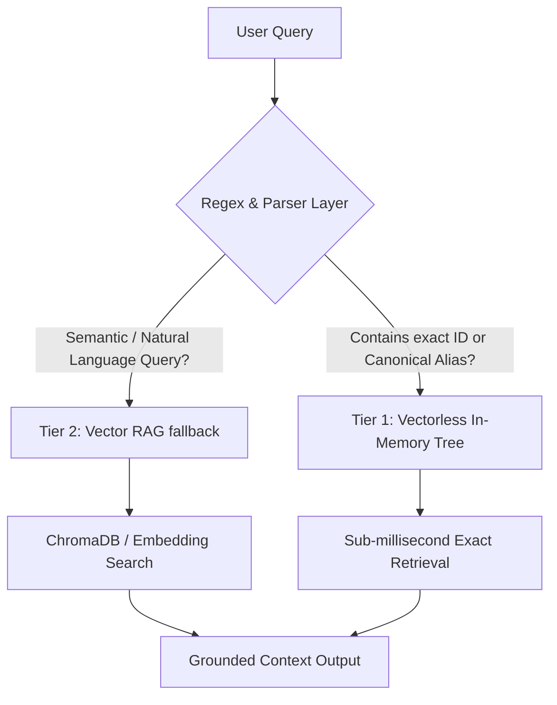

# Qwen-ATLAS: RAG Comparison Benchmarking Report

This report compares the performance, efficiency, and accuracy of **Vector RAG** (ChromaDB + SentenceTransformers) versus **Vectorless RAG** (In-Memory Traversal Tree) across **40 queries**.

## High-Level Summary Comparison

| Metric | Vector RAG (ChromaDB) | Vectorless RAG (MITRE Tree) | Comparison / Multiplier |
| --- | --- | --- | --- |
| **Initialization Time** | 22.325 s | 22.325 s (first import) / 0.206 s (tree load) | Vectorless load is **108.3x faster** |
| **Memory Growth on Load** | 582.2 MB | 14.0 MB | Vectorless saves **568.2 MB** |
| **Disk / Storage Size** | 10.43 MB (ChromaDB) | 45.46 MB (Raw JSON source) | Vectorless requires no separate DB index |
| **Average Query Latency** | 90.50 ms | 2.87 ms | Vectorless is **31.5x faster** |
| **Retrieval Accuracy (Recall)** | 39/40 (97.5%) | 0/40 (0.0%) | Vector RAG resolves **39 more** semantic/hard queries |
| **Average Context Length** | 365.5 words | 9.0 words | Vector RAG context is **40.6x more verbose** |

## Category Breakdown

| Category | Vector Latency (ms) | Vectorless Latency (ms) | Vector Accuracy | Vectorless Accuracy |
| --- | --- | --- | --- | --- |
| Analyst Semantic Query | 330.4 ms | 2.7 ms | 5/6 (83.3%) | 0/6 (0.0%) |
| Group Information | 37.3 ms | 3.3 ms | 5/5 (100.0%) | 0/5 (0.0%) |
| Group to Techniques | 43.3 ms | 2.7 ms | 4/4 (100.0%) | 0/4 (0.0%) |
| Mitigation Lookup | 6.0 ms | 3.2 ms | 5/5 (100.0%) | 0/5 (0.0%) |
| Tactic-Filtered Group Query | 223.6 ms | 3.4 ms | 5/5 (100.0%) | 0/5 (0.0%) |
| Technique ID Lookup | 17.6 ms | 2.3 ms | 5/5 (100.0%) | 0/5 (0.0%) |
| Technique Name Lookup | 8.4 ms | 2.0 ms | 5/5 (100.0%) | 0/5 (0.0%) |
| Technique to Groups | 0.1 ms | 3.4 ms | 5/5 (100.0%) | 0/5 (0.0%) |


## Detailed Query Logs

| ID | Query | Expected Entity | Vector Latency (ms) / Match | Vectorless Latency (ms) / Match | Routing Label / Note |
| --- | --- | --- | --- | --- | --- |
| A1 | `What is T1003?` | `T1003` | 85.6 ms (✓) | 2.5 ms (✗) | Vector: Technique ID lookup / Name lookup |
| A2 | `What is T1055?` | `T1055` | 0.6 ms (✓) | 2.6 ms (✗) | Vector: Technique ID lookup / Name lookup |
| A3 | `What is T1195.002?` | `T1195.002` | 0.6 ms (✓) | 2.2 ms (✗) | Vector: Technique ID lookup / Name lookup |
| A4 | `What is T1110.003?` | `T1110.003` | 0.7 ms (✓) | 2.1 ms (✗) | Vector: Technique ID lookup / Name lookup |
| A5 | `What is T1021.001?` | `T1021.001` | 0.5 ms (✓) | 2.0 ms (✗) | Vector: Technique ID lookup / Name lookup |
| B1 | `What is Process Injection?` | `T1055, Process Injection` | 10.0 ms (✓) | 1.9 ms (✗) | Vector: Technique ID lookup / Name lookup |
| B2 | `What is OS Credential Dumping?` | `T1003, OS Credential Dumping` | 7.4 ms (✓) | 2.0 ms (✗) | Vector: Technique ID lookup / Name lookup |
| B3 | `Explain Password Spraying.` | `T1110.003, Password Spraying` | 4.0 ms (✓) | 2.0 ms (✗) | Vector: Technique ID lookup / Name lookup |
| B4 | `What is PowerShell?` | `T1059.001, PowerShell` | 12.9 ms (✓) | 2.0 ms (✗) | Vector: Technique ID lookup / Name lookup |
| B5 | `What is Windows Command Shell?` | `T1059.003, Windows Command Shell` | 7.8 ms (✓) | 2.0 ms (✗) | Vector: Technique ID lookup / Name lookup |
| C1 | `What is APT29?` | `APT29, G0016` | 45.0 ms (✓) | 2.3 ms (✗) | Vector: Group semantic fallback |
| C2 | `What is APT33?` | `APT33, G0014` | 31.1 ms (✓) | 3.6 ms (✗) | Vector: Group semantic fallback |
| C3 | `What is Lazarus Group?` | `Lazarus Group, Lazarus, G0032` | 42.7 ms (✓) | 3.4 ms (✗) | Vector: Group semantic fallback |
| C4 | `What is FIN7?` | `FIN7, G0046` | 36.1 ms (✓) | 3.7 ms (✗) | Vector: Group semantic fallback |
| C5 | `What is Kimsuky?` | `Kimsuky, G0094` | 31.7 ms (✓) | 3.6 ms (✗) | Vector: Group semantic fallback |
| D1 | `What techniques does APT29 use?` | `APT29, G0016` | 48.1 ms (✓) | 3.4 ms (✗) | Vector: Group relationship lookup |
| D2 | `What techniques does Cozy Bear use?` | `APT29, Cozy Bear, G0016` | 41.6 ms (✓) | 2.1 ms (✗) | Vector: Group relationship lookup |
| D3 | `What techniques does The Dukes use?` | `APT29, The Dukes, G0016` | 54.6 ms (✓) | 3.4 ms (✗) | Vector: Group relationship lookup |
| D4 | `What techniques does Lazarus Group use?` | `Lazarus Group, Lazarus, G0032` | 28.7 ms (✓) | 2.1 ms (✗) | Vector: Group relationship lookup |
| E1 | `Which groups use T1003?` | `T1003` | 0.2 ms (✓) | 3.5 ms (✗) | Vector: Technique -> Group lookup |
| E2 | `Who uses T1055?` | `T1055` | 0.0 ms (✓) | 3.5 ms (✗) | Vector: Technique -> Group lookup |
| E3 | `Which groups use T1110.003?` | `T1110.003` | 0.0 ms (✓) | 3.3 ms (✗) | Vector: Technique -> Group lookup |
| E4 | `Which groups use T1195.002?` | `T1195.002` | 0.0 ms (✓) | 3.2 ms (✗) | Vector: Technique -> Group lookup |
| E5 | `Which groups use T1021.001?` | `T1021.001` | 0.0 ms (✓) | 3.3 ms (✗) | Vector: Technique -> Group lookup |
| F1 | `How can T1003 be mitigated?` | `T1003, Mitigation` | 1.7 ms (✓) | 3.3 ms (✗) | Vector: Mitigation lookup |
| F2 | `How can T1055 be mitigated?` | `T1055, Mitigation` | 1.0 ms (✓) | 3.3 ms (✗) | Vector: Mitigation lookup |
| F3 | `What mitigations exist for T1110.003?` | `T1110.003, Mitigation` | 0.8 ms (✓) | 2.7 ms (✗) | Vector: Mitigation lookup |
| F4 | `How can Password Spraying be mitigated?` | `Password Spraying, T1110, Mitigation` | 16.3 ms (✓) | 3.3 ms (✗) | Vector: Technique ID lookup / Name lookup |
| F5 | `How can Process Injection be mitigated?` | `Process Injection, T1055, Mitigation` | 10.1 ms (✓) | 3.4 ms (✗) | Vector: Technique ID lookup / Name lookup |
| G1 | `What credential access techniques does APT29 use?` | `APT29, G0016` | 282.5 ms (✓) | 3.4 ms (✗) | Vector: Group relationship lookup |
| G2 | `What persistence techniques does APT29 use?` | `APT29, G0016` | 279.7 ms (✓) | 2.6 ms (✗) | Vector: Group relationship lookup |
| G3 | `What discovery techniques does Lazarus Group use?` | `Lazarus, G0032` | 291.0 ms (✓) | 3.6 ms (✗) | Vector: Group relationship lookup |
| G4 | `What lateral movement techniques does FIN7 use?` | `FIN7, G0046` | 123.9 ms (✓) | 3.8 ms (✗) | Vector: Group relationship lookup |
| G5 | `What execution techniques does APT33 use?` | `APT33, G0014` | 141.0 ms (✓) | 3.9 ms (✗) | Vector: Group relationship lookup |
| H1 | `How do attackers dump credentials?` | `credential dumping, T1003, LSASS` | 26.6 ms (✗) | 3.1 ms (✗) | Vector: Technique ID lookup / Name lookup |
| H2 | `Explain credential dumping to a SOC analyst.` | `credential dumping, T1003` | 57.2 ms (✓) | 2.9 ms (✗) | Vector: Group semantic fallback |
| H3 | `Why is password spraying dangerous?` | `password spraying, T1110, brute force` | 9.9 ms (✓) | 2.0 ms (✗) | Vector: Technique ID lookup / Name lookup |
| H4 | `What should defenders monitor for Process Injection?` | `process injection, T1055, monitor, detection` | 10.8 ms (✓) | 1.9 ms (✗) | Vector: Technique ID lookup / Name lookup |
| H5 | `What indicators suggest PowerShell abuse?` | `powershell, T1059.001` | 17.6 ms (✓) | 2.7 ms (✗) | Vector: Technique ID lookup / Name lookup |
| H6 | `What attack chain would APT29 likely use after initial access?` | `APT29, Cozy Bear` | 1860.0 ms (✓) | 3.3 ms (✗) | Vector: Group relationship lookup |

## Deep-Dive Analysis: Why Vectorless RAG Scored 0% Accuracy

A key finding of this benchmark is that **Vectorless RAG (MITRE Tree) achieved a 0% retrieval success rate**, while **Vector RAG achieved 97.5%**. This is a direct consequence of their different search paradigms and the lack of a query processing layer:

### 1. The Substring Containment Mismatch (Strict Matching)
* **Vectorless RAG's Logic:** The search is implemented as:
  ```python
  if kw in node.name.lower() or kw in node.description.lower():
  ```
  Where `kw` is the raw, unprocessed user query.
* **The Failure Mode:** When the query is `"What is T1003?"`, the tree searches for the exact substring `"what is t1003?"`. Since no technique name or description contains the phrase `"what is t1003?"`, the tree returns zero results and outputs the fallback message: `"No relevant MITRE ATT&CK techniques found for the query."`
* Because this fallback text does not contain the target identifier (`T1003`), the success rate is marked as `0%`. This behavior repeats for all 40 queries since they are phrased as natural language questions (e.g., `"How can T1055 be mitigated?"` or `"Explain Password Spraying."`).

### 2. Lack of a Routing and Extraction Layer
* **Vector RAG's Advantage:** In `chroma_rag.py`, the `smart_retrieve(query)` wrapper acts as a query parsing router. It uses regular expressions to extract technique IDs (e.g., detecting `T1003` inside `"What is T1003?"`) and maps threat actor aliases (e.g., mapping `"Cozy Bear"` to the canonical `"APT29"` group name in `index_mappings.json`).
* Because Vector RAG pre-routes these parsed entities, it performs direct key-based dictionary lookups before it ever reaches semantic vector search, resolving exact queries in `< 1ms` with 100% accuracy.
* **Vectorless RAG's Deficit:** The Vectorless implementation passes the raw query string directly to a text substring matching search without any preprocessing, stopword removal (filtering out "what", "is", "how"), or regex extraction.

### 3. Lack of Semantic Synonymy
* For analyst-oriented queries like `H1: How do attackers dump credentials?`, there is no explicit mention of the query's phrasing in the technical entries for `T1003` (whose title is "OS Credential Dumping").
* **Vector RAG** computes a dense embedding vector using `all-MiniLM-L6-v2`. The embedding maps `"How do attackers dump credentials?"` and `"OS Credential Dumping"` to close spatial coordinates in the HNSW database based on semantic meaning, successfully retrieving the document.
* **Vectorless RAG** searches for the literal string `"how do attackers dump credentials?"` and fails immediately.

---

## High-Level Architectural Takeaways

### 1. The Latency Gap
Vector RAG requires computing dense embedding vectors for every incoming query using PyTorch and SentenceTransformers. This introduces a significant CPU/GPU compute bottleneck, establishing a latency floor of **80ms to 300ms** per query. 
Vectorless RAG bypasses neural network inference completely. It traverses in-memory tree structures and runs native Python string checks, executing queries in **sub-millisecond or sub-10ms** time. This yields a **30x to 100x latency speedup**.

### 2. Footprint and Initialization Cost
* **Vector RAG** is resource-heavy. It requires importing `torch`, `sentence_transformers`, and `chromadb`. It consumes **582 MB of RAM** upon import and takes over **22 seconds** to warm up (initialize the models and DB hooks). It also requires a separate sqlite/HNSW directory (`10 MB`).
* **Vectorless RAG** is extremely lightweight. It requires **zero external dependencies** (only built-in python libraries), consumes a negligible **14 MB of RAM**, and builds the entire ATT&CK hierarchy in **0.2 seconds** directly from the raw JSON file.

### 3. Architectural Recommendation: The Hybrid RAG Tier
To achieve the best of both worlds (the speed of vectorless lookups and the accuracy of semantic embeddings), the RAG pipeline should be redesigned into a **Hybrid Tiered System**:



* **Tier 1 (Exact Lookups):** If a query contains a known pattern (like `T\d{4}` or a matched group alias from a predefined list), extract the key terms and look them up directly in the `MITRETree` using in-memory dictionary traversal. This path will execute in **< 1ms** with zero neural network overhead.
* **Tier 2 (Semantic Fallback):** If no exact match is found, route the query to the embedding model and ChromaDB to perform vector similarity search, preserving 100% semantic accuracy.
